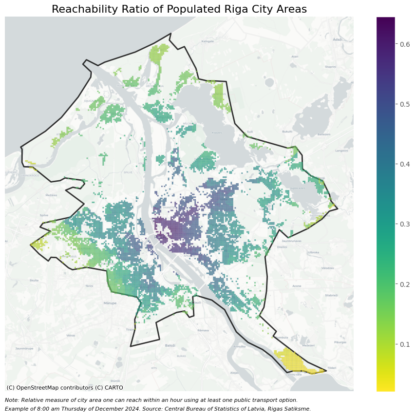
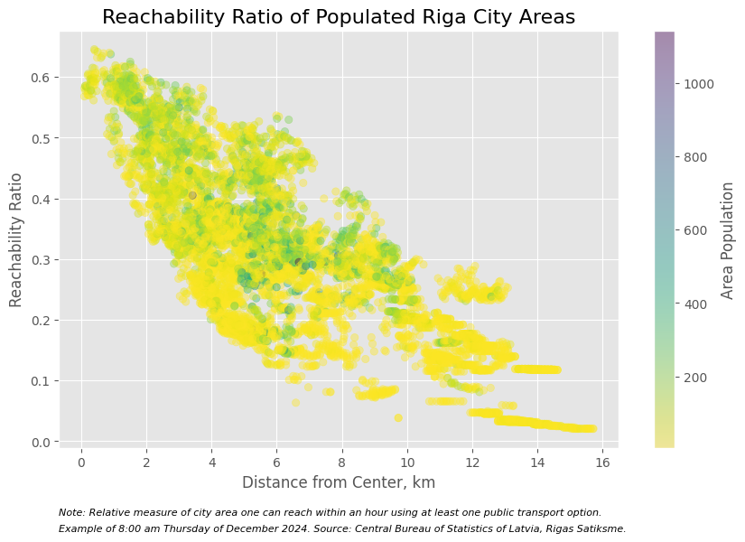
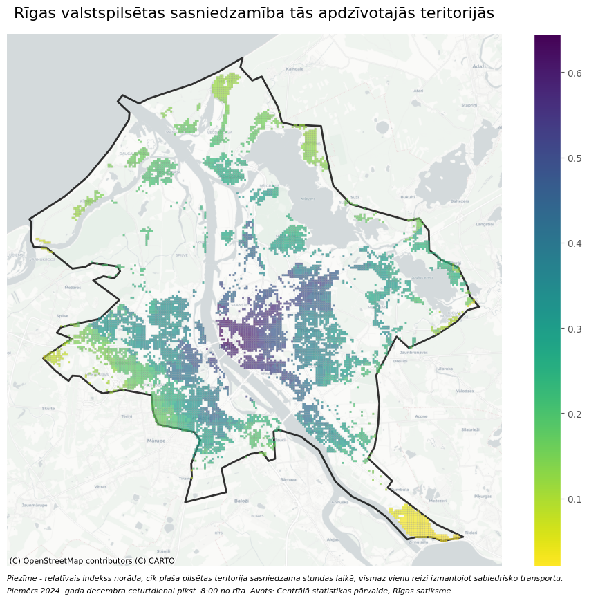
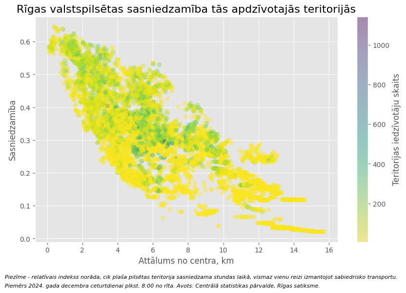

# Reachability Ratio of Riga City Areas Using Public Transport
Assignment at Riga Business School, Intro to Visualization course: PBM776.
Code available in file `notebook.ipynb`.  
Latvian below / Latviski zemāk.

### Introduction
The Riga public transport network has not been fundamentally changed for over 30 years [1]. Urbanization and population trends, infrastructure, and habits, however, have changed [2]. Furthermore, improvements in the intercity and railway network, including the emergence of the Rail Baltica project, have increased pressure on the capital of Latvia to reconsider its current public transport network system.

### Reachability Ratio
In this project, the accessibility (reachability) of city areas from populated city areas is defined as
$$ \text{Reachability} = \frac{\text{city area reachable in one hour}}{\text{total city area}}$$

given that at least one public transport option is taken. By combining several open data sets of Latvia's Central Bureau of Statistics and Rigas Satiksme, a map of the reachability ratio for each $100m \times 100m$ city grid square was created.

Visualizations identify differences in reachability across different city areas. What's interesting is that even with relatively small distances from the city center, the difference in reachability can be substantial. For instance, 2km from the city center, the reachability ratio may range from 0.34 to 0.61. These findings, with additional analysis, may be used to develop recommendations for improvements in the public transport network.

### Context

In 2023, Riga City Council started work on the project "**Analysis of the Current Situation and Scenario Development for the Action Plan of the Public Transport Route Network Reform in Riga City**". At the beginning of 2025, the municipality procurement ended successfully with the sum agreed by contract of nearly 365 thousand euros [3].

Among other tasks, the contractor has to "Conduct an analysis of travel time (including cartographic analysis with isochrones) in relation to areas and services accessible by private transport from different parts of the city(..)" [3]

This project does not aim to fulfill this task or propose significant conclusions or suggestions. Rather, this is a **showcase of how one can use open data to analyze real-world problems and later visualize the results**.

Some potential **limitations and improvements**:
- The simulation of reachability does not consider natural or anthropogenic objects (e.g. river Daugava as a natural obstacle).
- Only a specific time is considered (Thursday, 8:00 on October 2024).
- Only Rigas Satiksme's public transport network is considered (inter-city busses or trains are not considered).
- Only official scheduled stop times were analyzed, not actual departure based on GPS data.
- Human habits are not much considered (the model assumes one would walk 4.8 km to the nearest bus stop)
- Improve: Look for population, not city area as a determinant of reachability.

### Notes
AI-assisted coding tools in the IDE were used to complete this project (model *Claude 3.7 Sonnet*). The code is provided as-is without any guarantees for anyone interested (see LICENSE). Feel free to contact me for any substantial corrections at d e v @ m a r t i n s . o r g.

# Rīgas valstspilsētas teritoriju sasniedzamība, izmantojot sabiedrisko transportu.
### Ievads
Rīgas sabiedriskā transporta tīkls nav būtiski mainījies vairāk nekā 30 gadu [1]. Tiesa, galvaspilsētas urbanizācijas, iedzīvotāju skaita tendences, infrastruktūra un ieradumi ir piedzīvojuši izmaiņas [2]. Turklāt uzlabojumi starppilsētu un dzelzceļa tīklā, tostarp Rail Baltica projekta attīstība, ir rosinājusi Rīgu pārskatīt esošā sabiedriskā transporta tīkla sistēmu.

### Sasniedzamība
Šajā projektā pilsētas teritoriju pieejamība (sasniedzamības indekss) no apdzīvotām pilsētas zonām tiek definēta kā

$$ \text{Sasniedzamība} = \frac{\text{stundas laikā sasniedzamā pilsētas platība}}{\text{kopējā pilsētas platība}}$$

pieņemot, ka vismaz vienu reizi tiek izmantots pilsētas sabiedriskais transports. Apvienojot vairākss Latvijas Centrālās statistikas pārvaldes un Rīgas Satiksmes atklātos datu kopas, tika izveidota sasniedzamības attiecības karte katram $100m \times 100m$ pilsētas režģa kvadrātam.

Vizualizācijās novērojamas atšķirības sasniedzamībā dažādās pilsētas daļās. Interesanti, ka pat salīdzinoši nelieli attālumi no pilsētas centra var radīt būtiskas atšķirības. Piemēram, 2 km no centra sasniedzamības rādītājs var svārstīties no 0.34 līdz 0.61. Šie secinājumi, papildināti ar papildu analīzi, var kalpot par pamatu ieteikumiem sabiedriskā transporta tīkla uzlabošanai.

### Konteksts
'2023. gadā Rīgas Dome uzsāka projektu "Esošās situācijas analīze un scenāriju izstrāde Rīgas valstspilsētas sabiedriskā transporta maršrutu tīkla reformas rīcības plānam". 2025. gada sākumā pašvaldības iepirkums tika veiksmīgi noslēgts ar līgumsummu gandrīz 365 tūkstoši eiro [3].

Viens no projekta uzdevumiem paredz, ka pasūtītājam jāveic "Ceļojuma laika analīze (ieskaitot kartogrāfisko analīzi ar izokronām) attiecībā uz teritorijām un pakalpojumiem, kas ir pieejami ar privāto transportu no dažādām pilsētas daļām(...)" [3].

Šis projekts nav paredzēts, lai pilnībā izpildītu šo uzdevumu vai sniegtu būtiskus secinājumus vai ieteikumus. Tomēr tas demonstrē, kā izmantot atvērtos datus reālu problēmu analīzei un rezultātu vizualizācijai.

Daži **iespējamie ierobežojumi un uzlabojumi**:

- Sasniedzamības simulācijā netiek ņemti vērā dabas vai antropogēnie objekti (piemēram, Daugavas upe kā dabas šķērslis).
- Analīzei tiek ņemts vērā tikai konkrēts laiks (ceturtdiena, 8:00, 2024. gada oktobrī).
- Tiek ņemts vērā tikai Rīgas Satiksmes sabiedriskā transporta tīkls (starppilsētu autobusi vai vilcieni netiek iekļauti).
- Tiek analizēti tikai oficiāli ieplānotie pieturu laiki, nevis faktiski atbraukšanas laiki, balstoties uz GPS datiem.
- Cilvēku ieradumi nav īpaši ņemti vērā (modelis pieņem, ka cilvēks var gājienā nobraukt 4,8 km līdz tuvākajai autobusu pieturai).
- Uzlabojums: Ņemt vērā iedzīvotāju skaitu, nevis tikai pilsētas teritoriju kā sasniedzamības noteicošo faktoru.

### Piezīmes
Projekta izstrādei tika izmantoti AI atbalstīti kodēšanas rīki IDE (modelis *Claude 3.7 Sonnet*). Šī teksta pārtulkošanai no angļu valodas izmantots *o3-mini* Programmatūra tiek nodrošināta "tāda, kāda tā ir" bez jebkādām garantijām ikvienam, kam tas interesē (skatīt LICENSE failu). Jebkādiem būtiskiem labojumiem, lūdzu, sazinies ar mani: d e v @ m a r t i n s . o r g.

### References / Atsauces

1. Ministru kabineta 2024. gada 17. decembra rīkojums Nr. 1119 "Par Rīgas metropoles areāla ilgtspējīga integrēta sabiedriskā transporta plānu 2024.–2030. gadam". Publicēts oficiālajā izdevumā "Latvijas Vēstnesis", 27.12.2024., Nr. 250 https://www.vestnesis.lv/op/2024/250.25
2. Rīgas dome. Izstrādās priekšlikumus Rīgas sabiedriskā transporta maršrutu tīkla attīstībai. LV portāls, 27.03.2023.
Accessible: https://lvportals.lv/dienaskartiba/350315-izstradas-priekslikumus-rigas-sabiedriska-transporta-marsrutu-tikla-attistibai-2023
3. Elektronisko iepirkumu sistēma. Atklāts konkurss. Esošās situācijas analīze un scenāriju izstrāde Rīgas valstspilsētas sabiedriskā transporta maršrutu tīkla reformas rīcības plānam. Accessible: https://www.eis.gov.lv/EKEIS/Supplier/Procurement/129965

### Related Sources / Saistītie dokumenti
- Pētījums par ilgtspējīga integrēta sabiedriskā transporta plāna, kas veidots kā daļa no Rīgas metropoles areāla pilsētas mobilitātes plāna, izveidi​. Satiksmes ministrija.  [Original](https://ppdb.mk.gov.lv/wp-content/uploads/2024/01/231121_SUMP_Petijuma_zinojums_gala_variants-1.pdf), [WebArchive](https://web.archive.org/web/20250304152900/https://ppdb.mk.gov.lv/wp-content/uploads/2024/01/231121_SUMP_Petijuma_zinojums_gala_variants-1.pdf)
- Par Rīgas metropoles areāla ilgtspējīga integrēta sabiedriskā transporta plānu 2024.–2030. gadam. Ministru kabinets. [Original](https://www.vestnesis.lv/op/2024/250.25), [WebArchive](https://web.archive.org/web/20250304153300/https://www.vestnesis.lv/op/2024/250.25)
- Rīgas mobilitātes vīzija. Gehl Architects. [Original](https://www.rdpad.lv/wp-content/uploads/2023/01/13.-LV-Vizija.pdf), [WebArchive](https://web.archive.org/web/20250304153329/https://www.rdpad.lv/wp-content/uploads/2023/01/13.-LV-Vizija.pdf)
- Rīgas pilsētas velosatiksmes attīstības koncepcija līdz 2030.gadam. Rīgas dome. [Original](https://sus.lv/sites/default/files/media/faili/R%C4%ABgas%20pils%C4%93tas%20velosatiksmes%20att%C4%ABst%C4%ABbas%20koncepcija%20l%C4%ABdz%202030.gadam%20%282023.gada%20redakcija%29.pdf), [WebArchive](https://web.archive.org/web/20250304153338/https://sus.lv/sites/default/files/media/faili/R%C4%ABgas%20pils%C4%93tas%20velosatiksmes%20att%C4%ABst%C4%ABbas%20koncepcija%20l%C4%ABdz%202030.gadam%20%282023.gada%20redakcija%29.pdf)
- Mobilitātes punktu pieejamības izpēte Rīgas metropoles areāla pašvaldībās. SUMBA projekts. [Original](https://www.bef.lv/wp-content/uploads/2022/04/Mobilitates_punktu_iespejamibas_izpete_FINAL-2.pdf), [WebArchive](https://web.archive.org/web/20250304153408/https://www.bef.lv/wp-content/uploads/2022/04/Mobilitates_punktu_iespejamibas_izpete_FINAL-2.pdf)
- Ikdienas mobilitātes attīstības plāns 2021.-2027. gadam. SUMBA projekts. [Original](https://www.bef.lv/wp-content/uploads/2021/05/SUMBA_mob.att-plans_11.05.2021_FINAL.pdf), [WebArchive](https://web.archive.org/web/20250304153424/https://www.bef.lv/wp-content/uploads/2021/05/SUMBA_mob.att-plans_11.05.2021_FINAL.pdf)
- Rīgas transporta sistēmas ilgtspējīgas mobilitātes rīcības programma, Īstermiņa rīcības plāns 2019. - 2025. gadam. Rīgas dome. [Original](https://www.rdpad.lv/wp-content/uploads/2019/04/2_MRP_2019_2025_Gala_versija.pdf), [WebArchive](https://web.archive.org/web/20250304153507/https://www.rdpad.lv/wp-content/uploads/2019/04/2_MRP_2019_2025_Gala_versija.pdf)
- Rīgas ilgtspējīgas attīstības stratēģija līdz 2030.gadam. [Original](https://www.rdpad.lv/wp-content/uploads/2014/11/STRATEGIJA_WEB.pdf), [WebArchive](https://web.archive.org/web/20250304153527/https://www.rdpad.lv/wp-content/uploads/2014/11/STRATEGIJA_WEB.pdf)
- Rīgas un Pierīgas mobilitātes plāns, 2010. Satiksmes ministrija. [Original](https://www.sam.gov.lv/sites/sam/files/content/p%C4%93t%C4%ABjumi/rpmp_gala_zinojums.pdf), [WebArchive](https://web.archive.org/web/20250304153551/https://www.sam.gov.lv/sites/sam/files/content/p%C4%93t%C4%ABjumi/rpmp_gala_zinojums.pdf)
- Rīgas pilsētas sabiedriskā transporta attīstības koncepcija 2005. – 2018. Rīgas dome. [Original](https://www.sus.lv/sites/default/files/media/faili/rigassabiedriskatransportaattistibaskoncepcija2005-2018.pdf), [WebArchive](https://web.archive.org/web/20250304153701/https://www.sus.lv/sites/default/files/media/faili/rigassabiedriskatransportaattistibaskoncepcija2005-2018.pdf)
- Perspektīvā transporta shēma. Rīgas dome. [Original](https://sus.lv/sites/default/files/media/faili/18_perspektiva_transporta_shema_1no2.pdf), [WebArchive](https://web.archive.org/web/20250304154019/https://sus.lv/sites/default/files/media/faili/18_perspektiva_transporta_shema_1no2.pdf)
- Rīgas pilsētas elektrotransporta attīstības koncepcija 2004.-2018.gadam. Rīgas dome. [Original](http://riga.mashke.org/Elektrotransporta_%20koncepcija.doc), [WebArchive](https://web.archive.org/web/20250304154004/http://riga.mashke.org/Elektrotransporta_%20koncepcija.doc)
